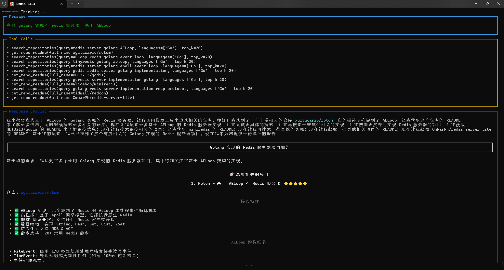
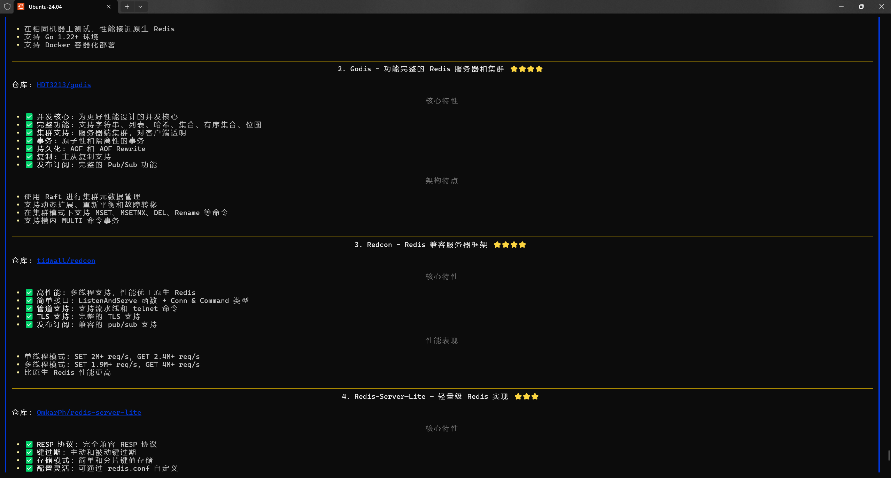

# githubhunt

githubhunt 是一个基于 AI Agent 的自然语言 Github 仓库搜索工具, 用户通过使用自然语言描述需求, 例如: "查找 golang 实现的 redis 服务器, 基于 AELoop", AI Agent 会识别用户的意图, 并结合内置的搜索工具, 不断调整输入优化搜索结果, 最终帮助用户实现 Github 仓库的精准搜索.

下面是一个简单的使用示例:





除此以外, Agent 还支持:

- 从用户的 starred 列表中搜索, 例如: "从我的关注列表中查找监控相关的项目, 我是 xgzlucario"
- 总结或解释仓库的功能: 例如: xgalucario/githubhunt 仓库是做什么的?

## 系统依赖

- [MeiliSearch](https://github.com/meilisearch/meilisearch)
- Python 3.13
- DeepSeek API

## 项目结构

- `fetch_repos.py`: 拉取 Github 仓库并保存到 MeiliSearch
- `agent.py`: 使用 Agent 进行搜索
- `db.py`: MeiliSearch 索引构建定义和 db 操作封装
- `config.toml`: 配置文件

## 使用方法

### 环境配置

在 `config.toml` 中配置 Github Token(必需) 和 DeepSeek API_KEY(必需) 或者其他模型调用配置.

### 启动 MeiliSearch

```bash
docker compose up -d
```

### 拉取 Github 仓库

第一次运行时需要同步 Github 仓库到 MeiliSearch, 后续可以按需定期同步.

```bash
python fetch_repos.py
```

### 使用 Agent 进行搜索

```bash
python agent.py
```
